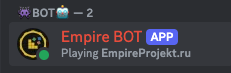

## **Первый заход**

Итак, вы зашли на сервер. Вам нужно:

1. Пройти анти-бот систему. При попытке зайти на сервер вас попросит ввести капчу.
2. Зарегистрироваться. Для этого вы введете то, что написано в чате.
3. Вас попросит принять набор ресурсов. Примите его, чтобы видеть [множество новых предметов](./newitems.md).

## **Большой пинг**

У нас есть два основных сервера:

- `ru.empireprojekt.ru` - Россия
- `play.empireprojekt.ru` - Франция

Попробуйте сменить IP сервера, чтобы уменьшить пинг.

## Социальная часть

Сервер очень сильно завязан на социальную составляющую для того, чтобы игроки общались друг с другом, а не играли в
одиночку.

Поэтому присоединитесь к нам:

- [Discord](https://discord.com/invite/Gwukdr8)
- [Telegram](https://t.me/empiresmp)

После присоединения к дискорду - вы сможете получить верифицированную роль.

- Введите в игре `/discord link`
- Полученный код отправьте боту в дискорде

  

## **Вы зашли**

Поздравляю, вы выполнили первую преграду! На спавне стоят НПС. Попробуйте поговорить с ними.

Первые 50 минут у вас будет дейстововать БАФ новичка - с ним будет довольно сложно умереть, но вы справитесь!

Некоторые продают вещи, а некоторые расскажут дельные советы.

Вам выдан ваш первый набор. С ним вам не нужно будет начинать все с нуля.

Пропишите `/tpr` чтобы телепортироваться со спавна или найдите NPC, который сделает это за вас.

## **Вы нашли дом без привата**

Вы вышли со спавна и нашли постройку другого игрока. Чтобы узнать, чья она - пропишите `/co near`.

Обычно не стоит ломать и гриферить чужие постройки. Однако если она не находится в привате - то считается общественной
собственностью. Поэтому можно ее сломать.

## **Вы умерли**

Как вы умудрились умереть с защитой новичка - непонятно, но ладно.

Не волнуйтесь. Первый час все ваши вещи в сохранности - их никто не сможет подобрать. Чтобы узнать
почему - [прочитайте про души](./souls.md)

## **Построить дом**

Чтобы ваш дом не загриферили - нужен приват. Он стоит довольно больших денег и вряд ли они у вас уже есть.

Попробуйте поспрашивать игроков - сможет ли кто-то принять вас в город.

Если же вы все-таки хотите создать собственный город - вам необходимо узнать [как поднять бабла](money.md)
и [как использовать Towny](towny.md)

## **Вот и все**

В целом, на этом все! Чтобы узнать что-то более подробно - смотрите конкретные страницы вики.