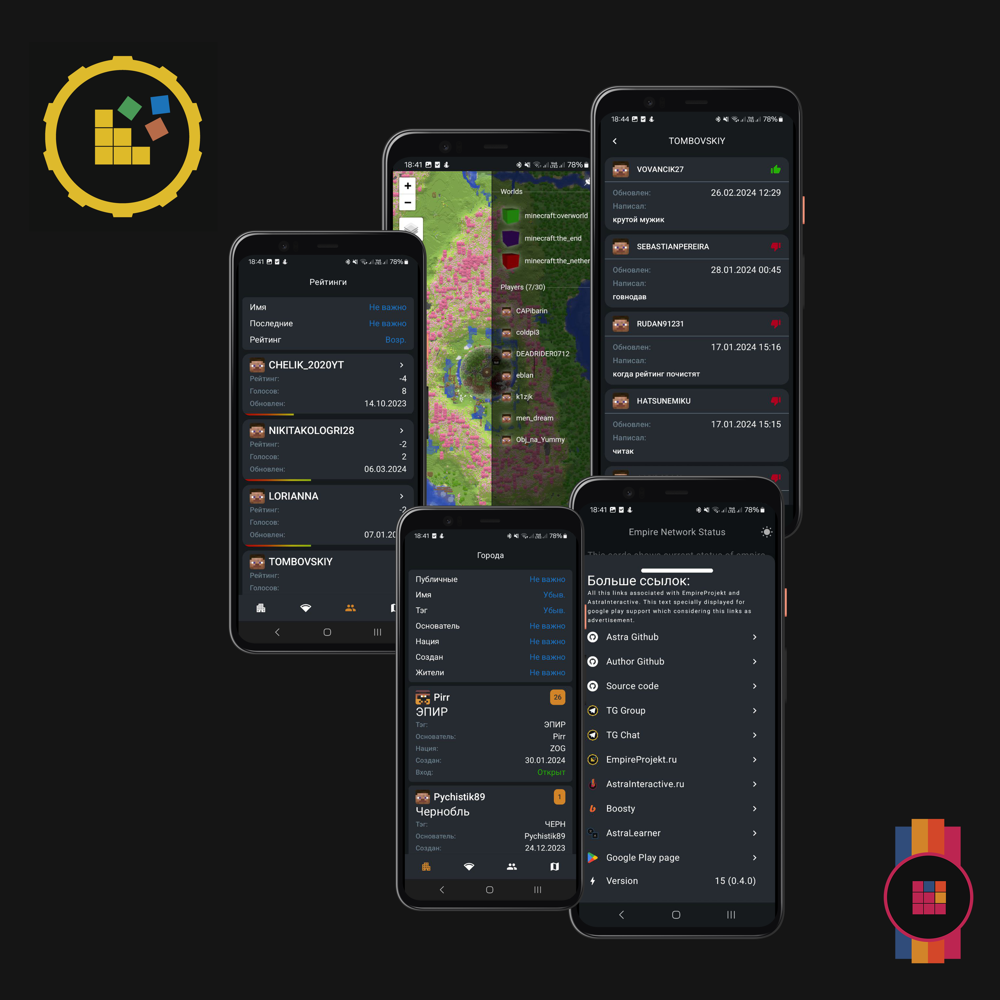

## **Что это за сервер?**

[EmpireProjekt](https://empireprojekt.ru) - это SMP (Survival Multiplayer) сервер, который пытается дать игрокам
максимально приятный опыт игры в майнкрафт.

### **Играйте, а не тратьте деньги**

У сервера нет коммерческой основы, все игроки имеют равные права, ничего не продаётся за реальные деньги. 

Однако на поддержку сервера тратятся огромные деньги, поэтому вы можете поддержать нас [BoostY (ТЫК)](https://boosty.to/empireprojekt/donate)

### **Не забанят за оскорбления**

Нет идиотских правил, заставляющих людей изображать жалкое подобие общения, здесь вы можете общаться так, как вам самим
это больше всего нравится и не будете получать за это наказание. Хотя мы, разумеется, осуждаем чрезмерную токсичность.

### **Баланс**

На сервере хорошая [ЭКОНОМИКА](money/main.md). Плагины на [РЫНОК](money/market.md), [МАГАЗИН](money/shop.md), смена погоды, бустеры - все это взаимосвязано.

### **Мобильное приложение**

У нас есть собственное [МОБИЛЬНОЕ ПРИЛОЖЕНИЕ](mobile.md). В целом там ничего масштабного, но вы можете посмотреть рейтинги, города,
миникарту и статус серверов.

### **Чем занять себя на сервере**

Если не знаете чем заняться, вот пара идей:

- Гриндить ресурсы и продавать их
- Построить автофермы железа, золота, пороха и т.д - они не запрещены
- Строить людям постройки за деньги
- Заработать и создать свой собственный город
- Создать огромный город и принимать в него всех желающих, тем самым построив собственную империю
- Зайти в [Дискорд](https://discord.com/invite/Gwukdr8) или [Telegram](https://t.me/empiresmp_discussion) и общаться там с людьми. В голосовом чате или текстовых каналах.
  Не обязательно даже играть в майнкрафт, чтобы быть частью комьнити - можете просто общаться в дискорде.
- Гриферить базы без привата
- Выполнять более 400 квестов!