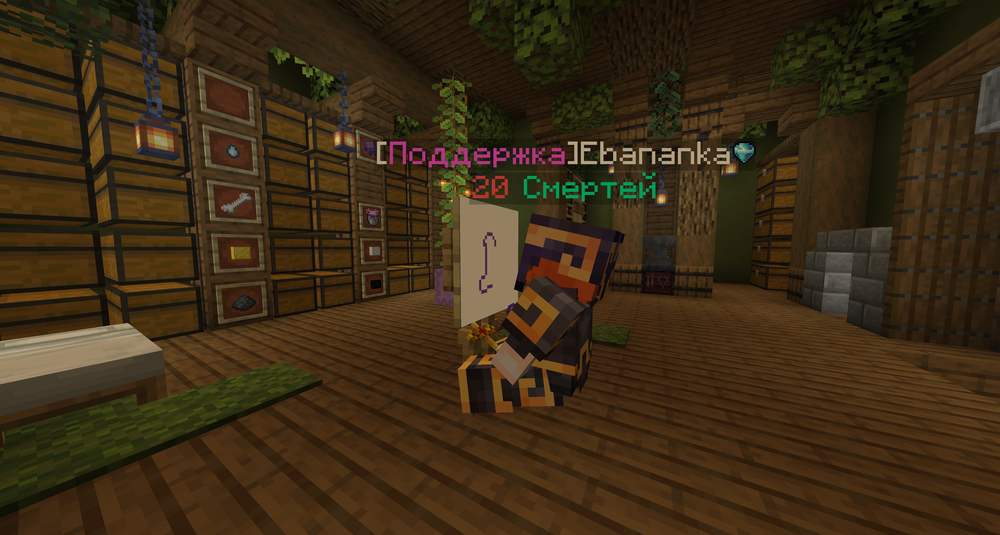
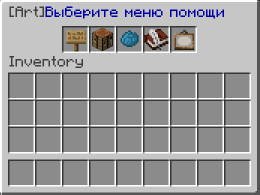

## Картины
Да, самые настоящие картины. С настоящим **МАЛЬБЕРТОМ**!

Почувствуйте себя художником! Используйте различный набор красителей и пусть ваш разум создаст нечто прекрасное!

{height=70%}

## Но как это делать?!
#### 1. Команды
- `/artmap` - Откроется меню, из которого вам все будет понятно. 
В меню есть список палитр(красок, которые можно использовать).
Также в меню находится крафт и список чужих картин!
- `/artmap save <NAME>` - Чтобы сохранить картину - надо ввести эту простую команду!

В целом на этом все. Если вы не сможете разобраться с плагином - значит вам еще нет 10 лет. Остальное будет понятно из меню!

Ах да, когда-то будет еще зал славы для картин!

