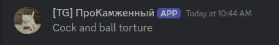

### Привязка аккаунтов

Привязка роли дает

- Расширенный спектр возможностей на сервере
- Роль в дискорде
- Роль в игре
- Больше хомов
- Большо слотов
- Возможность создавать город
- Возможность выполнения квестов

Кроме этого, когда вы будете писать в Дискорде, Телеграме или игре - игрокам будет понятно, кто конкретно пишет

- В дискорде будет отображаться аккаунт дискорда
- В игре будет отображаться никнейм из игры
- В телеграме будет отображаться никнейм из телеграма

{ width=70% }

**Чтобы прилинковать аккаунт:**

- В игре введите `/link`. Вам будет выдан код
- В `#🎮ㆍмайн-чат` телеграма или дискорда ввадите `/link ВАШ_КОД`
- Ваш аккаунт будет привязан к социальной сети, в которой вы ввели код
- Проделайте то же самое для следующей социальной сети

### PlasmoVoice

Установлен голосовой чат. Скачать его можно [ТУТ (ТЫК)](https://modrinth.com/plugin/plasmo-voice)

Кроме этого вы можете использовать диски с музыкой:

- `/disc burn <url> [name]` - Записать музыку на диск 
- `/disc erase` - Стереть музыку с диска
