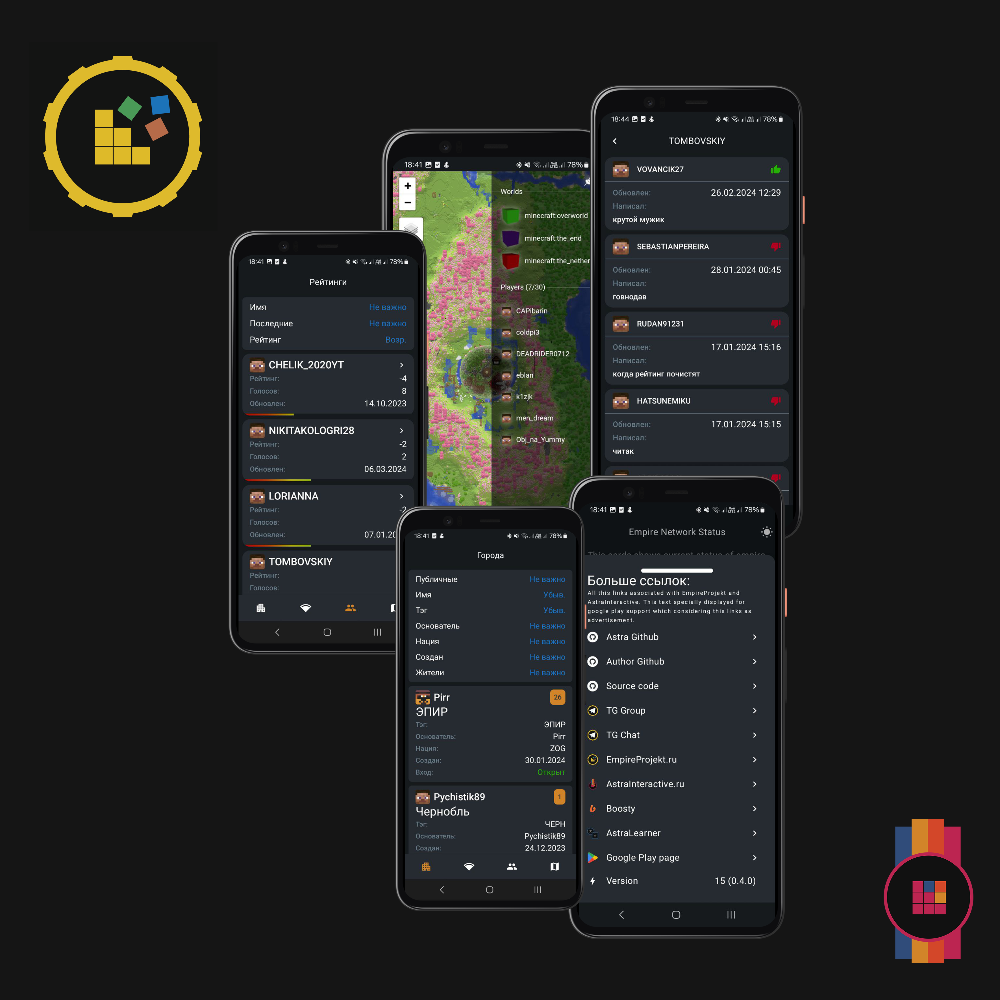

[GooglePlay](https://play.google.com/store/apps/details?id=com.makeevrserg.empireprojekt.mobile)
или [GitHub](https://github.com/makeevrserg/EmpireProjekt-Mobile)

У нас не только куча самописных плагинов, но и собственное мобильное приложение.

Так как оно очень легковесное - с помощью него можно удобно смотреть карту мира. Буквально быстрее чем открывать
браузер!
У нас есть рейтинг игроков, но в игре список просматривать не так удобно. Другое дело в приложении! Ищите игрока или
просто смотрите рейтинги.

    
     

Также вы можете смотреть статус сервера и города игроков. Приложение развивается и поэтому в будущем будет добавлено
что-то еще!

