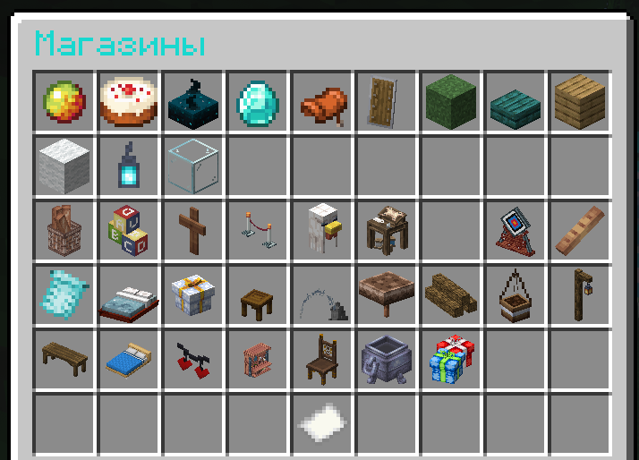
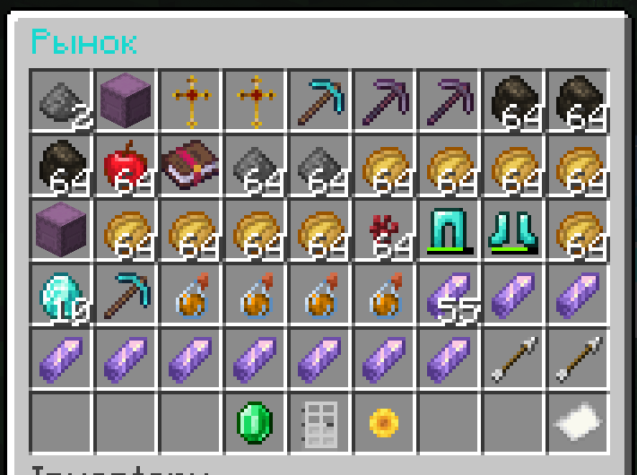

## Как же зарабатывать и тратить деньги

### Магазин

Это основной способ заработка. Вы можете продавать и покупать предметы

- `/ashop` - Открыть магазин
- `/ashop qs` - Отрыть меню быстрой продажи

- 

### Рынок

На рынке вы можете посмотреть товары, которых нет в магазине или которые продают другие игроки

- `/amarket open ИГРОК` - открыть активные слоты игрока
- `/amarket expired ИГРОК` - открыть просроченные слоты игрока
- `/amarket open` - открыть активные слоты
- `/amarket expired` - открыть просроченные слоты
- `/amarket players`  - открыть список игроков с активными слотами
- `/amarket sell ЦЕНА КОЛИЧЕСТВО` - продать предмет в руки по цене `ЦЕНА` в количества `КОЛИЧЕСТВО`

- 

### [GitHub рынка](https://github.com/Astra-Interactive/AstraAuctions)

### [GitHub магазина](https://github.com/Astra-Interactive/AstraShop)