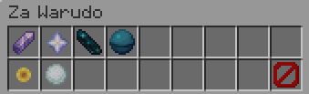
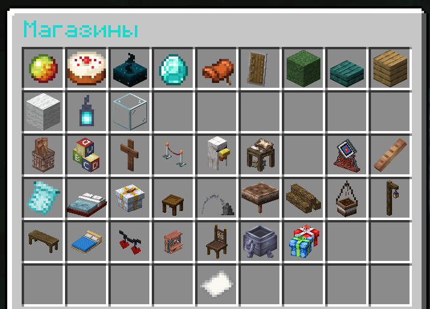
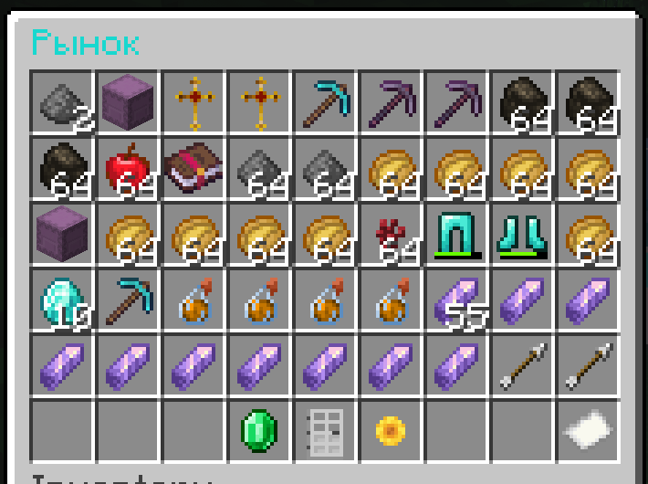

## Где потратить

#### Бустеры

Бустеры дают на определенное количество времени эффекты

`/menu boosters`

#### Управление миром

За определенную цену вы можете установить время дня и погоду

`/menu daytime`

#### Магазин

В магазине вы можете покупать строительные материалы, декорации и т.д. Подробности ниже.

#### Рынок

На рынке вы можете покупать предметы других игроков, которых нет в магазине. Подробности ниже.

#### Город

Если вы хотите собственную империю - создайте город. Используйте валюту для увеличения количества доступной
территории. [ПОДРОБНЕЕ (ТЫК)](../mechanics/towns.md)

## Постоянный заработок

#### Квизы

При игре на сервере вы будете в чате видеть уведомления. Это может быть анаграмма или уравнение. При правильном ответе
на ваш баланс будет зачислена определенная сумма.

#### Достижения

За выполнение игрового прогресса также выдается валюта. В зависимости от сложности достижения меняется награда.

#### Руда, Монстры

При убийстве монстров, добыче руды выпадает различный уровень награды. Чем сложнее монстр, чем сложнее добыча руды - тем
выше награда.

Но не пытайтесь это заабузить. Потому что у вас не получится.

## Уникальный заработок

### Магазин

Самый простой способ заработка.

- Продавайте и покупайте различные ресурсы.
- Тратьте валюту на покупку косметических предметов(кастомный ресурс-пак)

Но учитывайте, что цены в магазине динамические.

**Чем больше товара - тем меньше цена!**

**Чем меньше товара - тем больше цена!**

Со времен товар регулируется и возвращается к изначальной цене.

Чем меньше игроков на сервере - тем сильнее скачет цена и количество товаров.

- `/ashop` - Открыть магазин
- `/ashop qs` - Отрыть меню быстрой продажи

### Рынок

На рынке вы можете посмотреть товары, которых нет в магазине или которые продают другие игроки.

Изначально слоты ограничены, но после привязки дискорда/телеграма количество
увеличивается. [ПОДРОБНЕЕ (ТЫК)](../mechanics/chat.md)

Вы можете:

- Открыть список всех слотов
- Открыть список игроков, у которых есть активные слоты
- Открыть список слотов выбранного игрока
- Показать или скрыть истекшие слоты

Команды:

- `/amarket open ИГРОК` - открыть активные слоты игрока
- `/amarket expired ИГРОК` - открыть просроченные слоты игрока
- `/amarket open` - открыть активные слоты
- `/amarket expired` - открыть просроченные слоты
- `/amarket players`  - открыть список игроков с активными слотами
- `/amarket sell ЦЕНА КОЛИЧЕСТВО` - продать предмет в руки по цене `ЦЕНА` в количества `КОЛИЧЕСТВО`

### Квесты

У нас есть более 300 квестов доступных для выполнения. За разные квесты предусмотрена разная награда. Монеты, опыт,
ресурсы. Подробнее в [КВЕСТАХ (ТЫК)](quests.md)