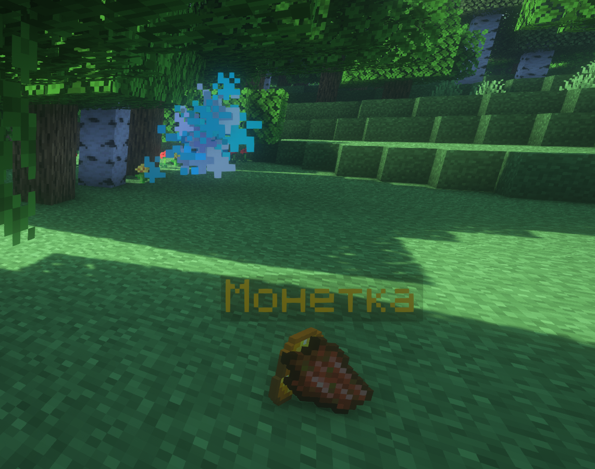

## Концепция душ

На сервере используется плагин, который сохраняет вещи после смерти в души.

Не важно где и как вы умерли - в лаве, в пустоте, ваши вещи все равно будут сохранены.

### Команды

`/souls` - Посмотреть список душ в **текущем мире**

### Когда душа исчезает

Срок жизни душ 7 дней.

Срок привязанности вашей души - 1 час. После истечения этого времени душа станет доступна всем!

### [GitHub плагина](https://github.com/Astra-Interactive/DeadSoulsKT) 